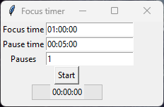
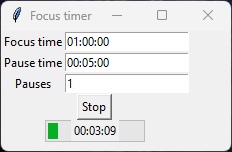

# focus_timer
focus_timer shows you a simple focus timer and the remaining pause time between two focus sessions.

Focus time defines the overall time (focus sessions + pauses) you want to spend. 
Pause time defines how long one break will be. 
Pauses defines the amount of pauses you want to have in your focus time.
  
As mentioned, the pauses are included in the focus time. 
Therefore a configuration like
- Focus time: 01:00:00
- Pause time: 00:15:00
- Pauses: 3

will result in real focus time of 15 minutes because the configured hour contains 3 pauses with 15 minutes.
  
If you want a real focus time of one hour and a total pause of 15 minutes, configure it like
- Focus time: 01:15:00
- Pause time: 00:15:00
- Pauses: 1

Simply follow this:
1. The pause time is fixed. It will always take the configured time.
2. Pause time will be multiplied by number of pauses. If you set pause time to 15 minutes and pauses to two, you will end up with two pauses 15 minutes each, therefore a total pause time of 30 minutes.
3. The total pause time is part of your focus time, therefore `"real" focus time = focus time - (pauses * pause time)`
## Configurations
focus_timer supports multiple configurations. An example is given in the code at the very beginning and used by default. 
The given configuration is:  
This means:
- Total time of one hour.
- Pauses with 5 minutes each.
- Only 1 pause.

Using this configuration you will end up with following slots:
- 27.5 minutes focus time
- Five minutes pause
- 27.5 minutes focus time

Additional configurations can be added directly in the code or by creating a file called "userConfiguration.py" which will be preferred by the application. 
### The following parameters can be configured
Parameter|Type|Example|Description
|--|--|--|--|
pauses|int|1|Amount of pauses
pauseTime|string|00:06:00|Pause time in format "%H:%M:%S"
focusTime|string|00:30:00|Focus time in format "%H:%M:%S"
pauseTimeEndSound|string|C:\\Windows\\Media\\Alarm02.wav|Sound to play when work time reaches 100%. No sounds included, find some on your computer.
focusTimeEndSound|string|C:\\Windows\\Media\\Alarm02.wav|Sound to play when work time reaches 100%. No sounds included, find some on your computer.

To select a specific configuration, use the command line argument.
## Command line arguments
Argument|Example|Description
|--|--|--|
-configuration|-configuration "dayShift"|Configuration to use. Defaults to "default".
-noTopmost|-noTopmost|Disable topmost attribute (window can covered by others).
## Screenshots

  
## License
Please see [LICENSE](LICENSE).